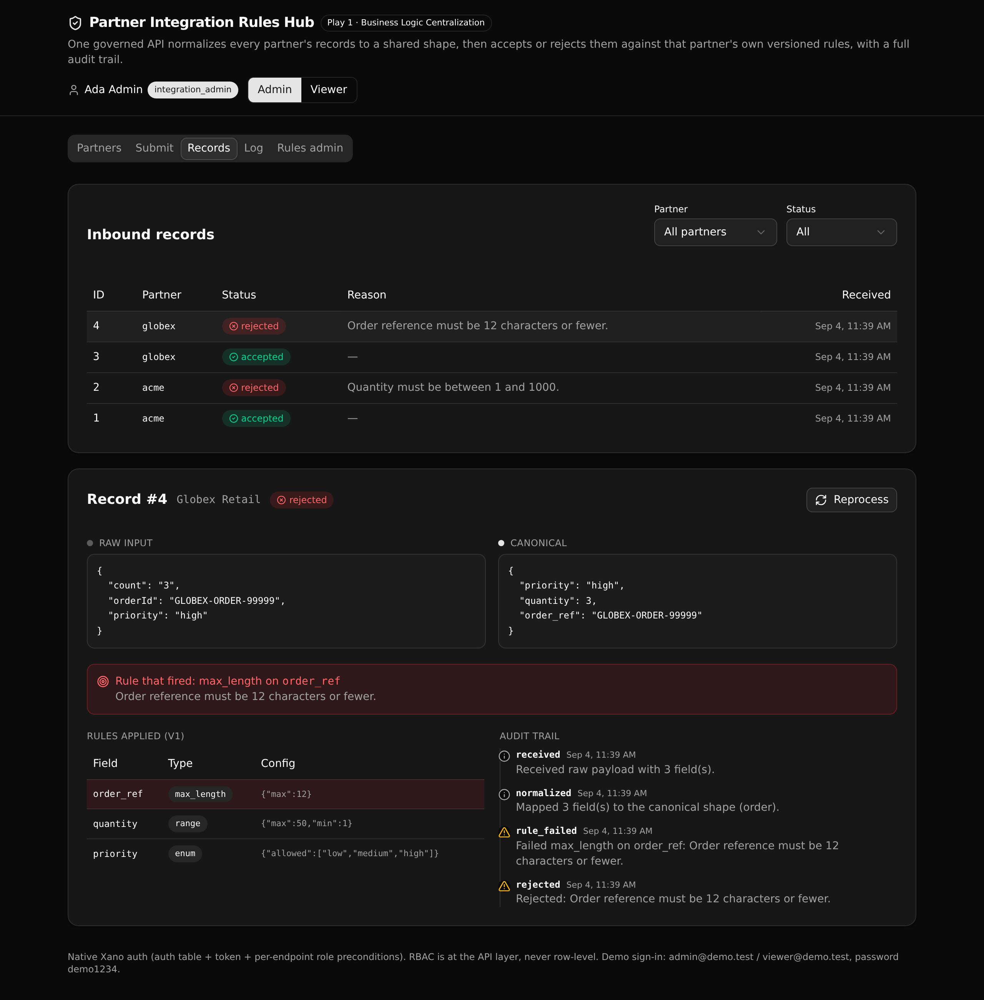

# Partner Integration Rules Hub

**Every partner's field mappings and validation rules in one governed API, so inbound records are normalized to a shared shape and accepted or rejected against that partner's own rules, with an audit trail of every decision.**

Play 1, Business Logic Centralization (the Hyperion partner integration pattern). The whole decision lives in one API layer a technical evaluator can read and trust: one shared rule engine, versioned rules, native API-layer RBAC, and a full processing log.

`6 tables · 12 APIs · 2 functions` · authored in TypeScript with [`@xanots/sdk`](https://www.npmjs.com/package/@xanots/sdk).



## What it demonstrates

Partner integration logic usually lives in scattered scripts: one per partner, each with its own field names and its own checks. This hub pulls that logic into one place. Each partner has a set of field mappings (how its raw field names map to a shared canonical shape) and a set of versioned validation rules. An inbound record from any partner runs through the same engine: normalize with that partner's mappings, then validate with that partner's active rules, then record the decision.

Why an evaluator cares:

- **One rule engine, not many scripts.** Two partners send different field names (`ref`/`qty` versus `orderId`/`count`) and both normalize to the same canonical shape (`order_ref`, `quantity`). The mappings and the rules are data, read from tables, not code branches.
- **Versioned rules.** A partner's rule set carries a version. Change the rules, bump the version, and old records keep the version they were decided under. Reprocess a record to apply the current version and watch the outcome change.
- **API-layer RBAC, never row-level.** Two roles (integration_admin and viewer). Write endpoints re-read the caller's role from the database and refuse a viewer with a 403. The gate is the API, not the UI.
- **A full audit trail.** Every decision writes one processing_log row per step (received, normalized, rule passed or failed, accepted or rejected), so a reviewer can read exactly why a record landed where it did.

## Repo layout

```
xano/
  index.ts                 the workspace: registers everything below
  tables/                  users, partners, field_mappings, validation_rules,
                           inbound_records, processing_log
  api/hub.ts               the API group (canonical slug "hub")
  api/*.ts                 the 12 endpoints
  functions/
    process-inbound.ts     the one governed job and the one write path
    require-admin.ts        the API-layer RBAC guard
  xano.lock                pinned object identities (committed)
frontend/
  src/lib/api.ts           the one contract: paths and types derived from the defs
  src/screens/             Partners, Submit, Records, Log, Rules admin
  src/components/          shared UI (StatusBadge, JsonBlock, EventTrail)
docs/
  index.html               the landing page (GitHub Pages)
  screenshot.png           the running app
```

## API surface

All endpoints sit under the `hub` API group, so the public path is `/api:hub/<name>`.

| Method | Path | Access | What it enforces |
| --- | --- | --- | --- |
| POST | `/api:hub/auth/login` | public | Verifies the password against the internal hash, mints a native token |
| GET | `/api:hub/auth/me` | any signed-in | Returns the caller (id, email, name, role) |
| GET | `/api:hub/partners` | any signed-in | Partners plus their mappings and active rules (the overview) |
| POST | `/api:hub/ingest` | any signed-in | The one governed job: normalize, validate, record the decision |
| GET | `/api:hub/records` | any signed-in | List and filter inbound records by partner and status |
| GET | `/api:hub/record/{id}` | any signed-in | One record with its payloads, applied rules, fired rule, and trail |
| GET | `/api:hub/log` | any signed-in | The processing log, filtered by partner and record |
| GET | `/api:hub/config/{partner_id}` | any signed-in | A partner's mappings and rule version history |
| POST | `/api:hub/mappings` | admin only | Create or update a field mapping (guarded by require_admin) |
| POST | `/api:hub/rules` | admin only | Add a validation rule to a partner's set (guarded) |
| POST | `/api:hub/reprocess/{record_id}` | admin only | Re-decide a record against the current active rules (guarded) |
| GET | `/api:hub/seed` | public | Deterministic demo seed (idempotent; `?force=true` to reset) |

The one governed job is `ingest`, and both `ingest` and `reprocess` funnel through the single `process_inbound` function, so a decision can never differ by caller.

## Quick start

You need a Xano account. From a clone:

```sh
git clone https://github.com/xano-scratch/partner-integration-rules-hub.git
cd partner-integration-rules-hub
npm install
npx xanots login          # one-time browser auth with your Xano account
npm run xano:deploy       # builds the frontend, deploys the backend, prints the live URL
```

Open the printed URL. The app seeds two demo partners with distinct mappings and rules, loads a handful of sample records, and signs you in as the admin. Use the Admin and Viewer switch in the header to see the API-layer role guard.

Demo sign-in: `admin@demo.test` or `viewer@demo.test`, password `demo1234`.

Local development against a deployed backend:

```sh
npm run xano:deploy       # once, so there is a backend to talk to
npm run dev               # vite dev server; set VITE_XANO_HOST in .env.local to the backend URL
```

## Try it

1. **Partners.** See both partners, their canonical target, and their mapping and active-rule counts. The two mapping sets reach the same canonical shape from different raw field names.
2. **Submit.** Pick a partner, edit the prefilled raw payload, and submit. See the raw input and the canonical shape side by side, with the decision and the rule that fired on a reject.
3. **Records.** Filter by partner and status, then open a record to see its payloads, the rules applied at its version, the exact rule that fired, and the step-by-step audit trail.
4. **Rules admin.** Add a rule for a partner, then go to Records and reprocess a record to watch the new rule take effect. Switch to the viewer role and try to save; the API returns 403.

## How the rule engine works

`process_inbound` loads the partner, its mappings, and its active rules, then runs one JavaScript lambda that normalizes the raw payload and validates the result in rule order. The lambda is the right tool here because the work loops over a variable, table-stored set of mappings and rules, which the typed statement surface cannot express. Everything around it stays typed: the reads, the writes, and the log. The function is the one write path, so ingest, reprocess, and the seed all reach the same decision logic.

## FAQ

**Is this row-level security?** No. Xano auth is at the API layer. Each write endpoint re-reads the caller's role from the database and refuses a viewer with a 403. Roles are enforced in the request, not on the row.

**Are the demo credentials safe to publish?** They are seed fixtures for a throwaway environment, not real accounts. The seed writes them through the password column's own hashing, the same as any signup.

**What about the live links?** The deploy targets a short-lived ephemeral environment, so any link shared from one build stops serving after it expires. Redeploy from a clone with `npm run xano:deploy` for fresh links.

## License

MIT. See [LICENSE](LICENSE).
